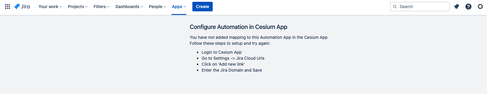
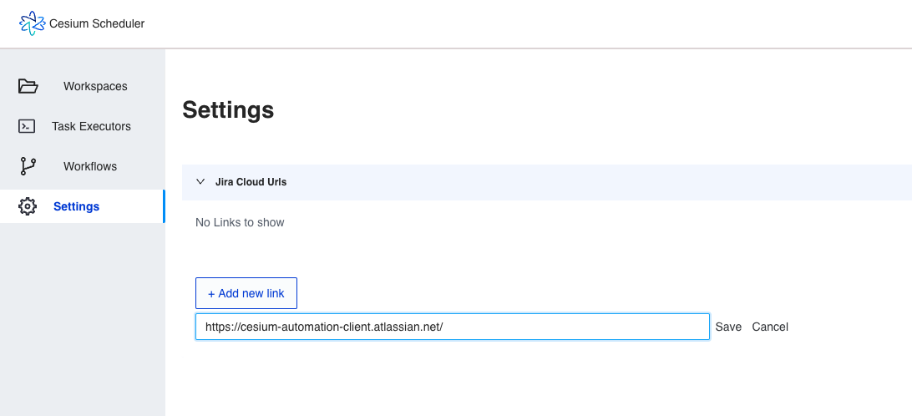
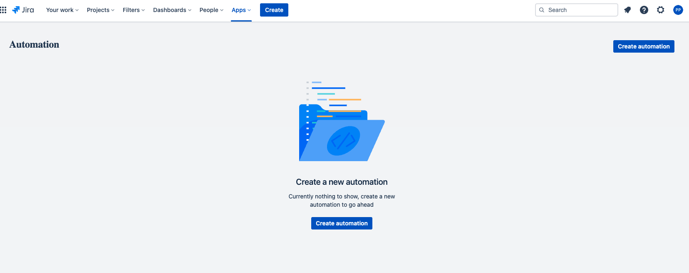
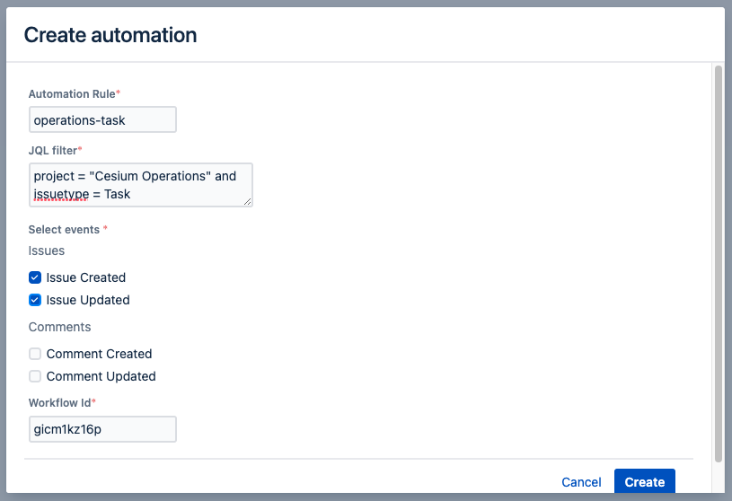
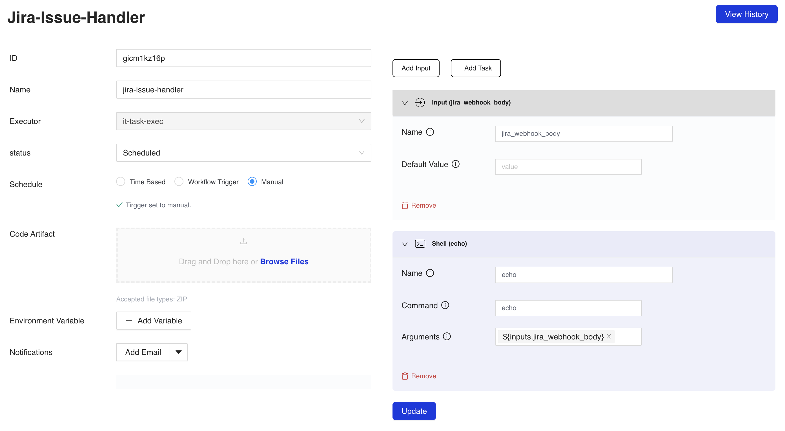
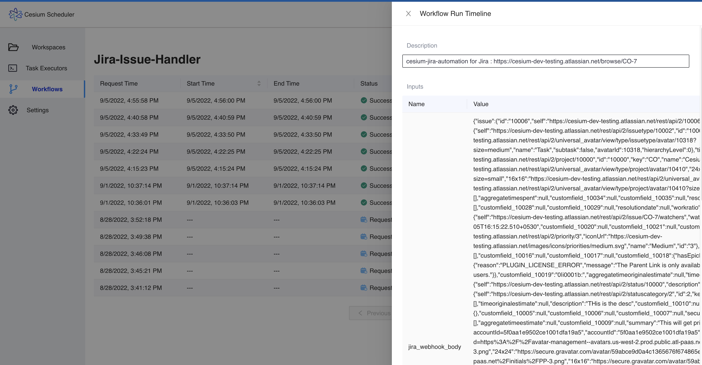

- [Jira Service Management](#jira-service-management)
- [Service Request Automation](#service-request-automation)
- [Jira Integration](#jira-integration)
  - [Prerequisites](#prerequisites)
  - [Installation on Jira Cloud Instance](#installation-on-jira-cloud-instance)
  - [Configuring in Cesium](#configuring-in-cesium)
  - [Configuring Automation Rules in Jira](#configuring-automation-rules-in-jira)
- [Accessing jira event body in Cesium workflow](#accessing-jira-event-body-in-cesium-workflow)
  - [Checking Workflow Run History](#checking-workflow-run-history)
  

# Jira Service Management
Most organizations today require a strong IT Team to help them harness the power of technology to power their business processes. Jira is one of the most popular IT Service Management tool used by IT teams to create a catalog of services they offer.
Read more about [ITSM and Jira here](https://www.atlassian.com/itsm/service-request-management).
At its core, Jira allows your business users to request services from your IT department in a smooth and systematic way and allows the organization to track on how well these services are being provided.

# Service Request Automation
A strong service request management practice can be streamlined with automation to deliver results to your customers faster.
Cesium Ops gives you the power to use your favorite technology like shell, Python, Docker etc to automate service requests and run the automation workflow in response to user requests in Jira.
You can use Cesium Ops to setup workflows and task executors in your infrastructure and then use our Jira integration to trigger the workflows on specific Jira events.

# Jira Integration
Cesium Ops has built a direct integration with Jira using [Atlassian's Connect framework](https://developer.atlassian.com/cloud/jira/platform/index/#connect-apps). With this integration, its now easier than ever to automate your service requests. 
Once you install this app on your Jira cloud instance, you need to configure your Jira instance's details inside Cesium Ops.
Once your app is configured and the 2 way handshake is complete, you can setup automation rules inside the Jira app and see them executed inside your infrastructure in response to Jira tickets.

## Prerequisites

* You need to be on Jira Cloud. If you are using any other version of Jira and are interested in using Cesium Ops, please contact us. Your jira url must be something like "https://<your-company-name>.atlassian.net"

* You need to signup for and use Cesium Ops.

## Installation on Jira Cloud Instance

This step must be performed by a Jira cloud admin user.

Navigate to the [Cesium Automation page on the Jira Marketplace](https://marketplace.atlassian.com/apps/1229019/cesium-automation). Click on "Get it Now" to install the app on your site. Follow the latest Jira app installation instructions.

Once the app is successfully installed, if you open the "Apps" menu on the top, you should see a new menu item that says "Cesium Automation".
Click on this menu item to load the home page of the Jira-Cesium integration.
The first time you reach this page, it will show you an set of instructions to configure the automation in Cesium.

## Configuring in Cesium
* Navigate to your Cesium Ops account and login.
* On the left menu, navigate to "Settings".
* On this page, you should see a section called "Jira Cloud URLs"
* Copy the host part from your Jira URL and paste it into the text area to add new Jira cloud URL and hit save.

## Configuring Automation Rules in Jira

Once you install the Jira app and configure the Jira cloud URL in Cesium, the 2 way handshake between Jira and Cesium is complete.
Now when you navigate back to the Cesium Automation app in Jira, you will see a different screen that allows you to configure automation rules.

If you don't see this screen after refreshing the browser, make sure you have saved the correct URL in Cesium configuration.

The primary model of configuring automation rules is to associate events in Jira along with a filtering criteria to a workflow in Cesium.

You can make the following events and search criteria to a Cesium workflow:
* [JQL Filter](https://support.atlassian.com/jira-software-cloud/docs/use-advanced-search-with-jira-query-language-jql/): Jira Query Language (JQL) is the query language provided by Atlassian Jira to search for issues and to filter issues. You can setup a JQL after testing it inside the advanced search feature in Jira. Note that the full JQL spec is not supported and only a subset of features are available. Please refer to [Jira documentation for supported JQL queries](https://developer.atlassian.com/cloud/jira/platform/webhooks/#supported-jql-queries).
* Events: Cesium can listen for events where an issue matching the JQL configured is created or updated and when a comment is added to or updated on an issue which matches the JQL. You can select one or more events based on when you want your script executed.
* Workflow Id: This is the workflow id of the workflow in Cesium you want to execute whenever an event matching an issue that matches the JQL occurs.

Once you fill in these values and store it, it creates an automation rule and registers this webhook with Jira. Whenever an issue gets created or updated matching the JQL criteria configured in the automation rule, Jira invokes a webhook to Cesium and Cesium will execute mapped workflow on the appropriate tex configured for the workflow. 
The typical time taken from the issue event occuring in Jira to the workflow getting executed is < 10s.

# Accessing jira event body in Cesium workflow

When the issue event occurs in Jira, Jira sends a webhook payload that depends on the event that occured. It has details on the user performing the action, the issue, timestamp, event type etc.
You can refer to the [Jira documentation on the schema here](https://developer.atlassian.com/cloud/jira/platform/webhooks/#webhook-payload).
To build a script that successfully runs with the Jira data, the workflow in cesium:
* Must be configured to be a manually triggered workflow
* Must have a single input variable called `jira_webhook_body`
* The input variable must be configured as an argument to some task in your workflow as `${inputs.jira_webhook_body}`
  
If these criteria are not met, the workflow might not be executed correctly.

## Checking Workflow Run History
If you want to see the runs of a workflow, navigate to the workflow details and click on "View History" button on the top right corner of the page.
The next page will show you each run of the workflow. Clicking on any row will show you details of the specific workflow run. If the run was triggered from the Jira Cesium integration, the description will contain the issue for which this run was triggered and the payload from Jira will be listed as a parameter and is available for debugging.

